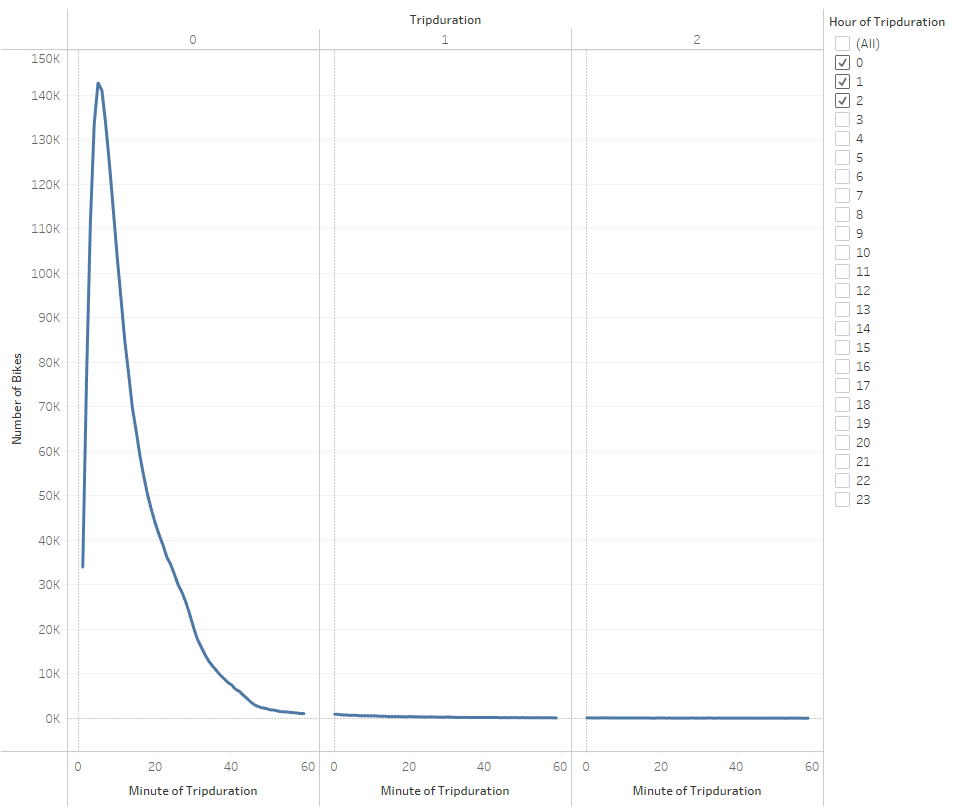
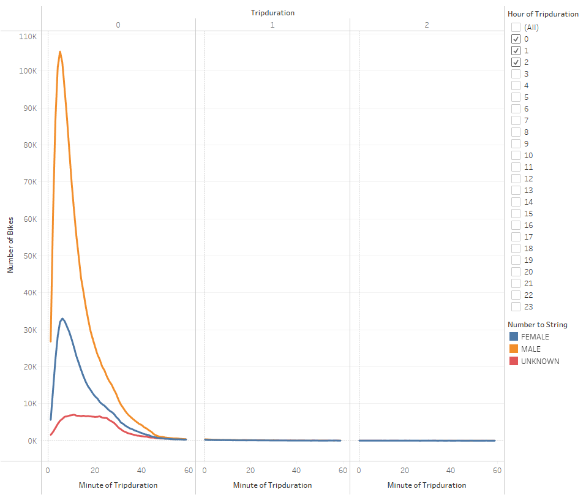
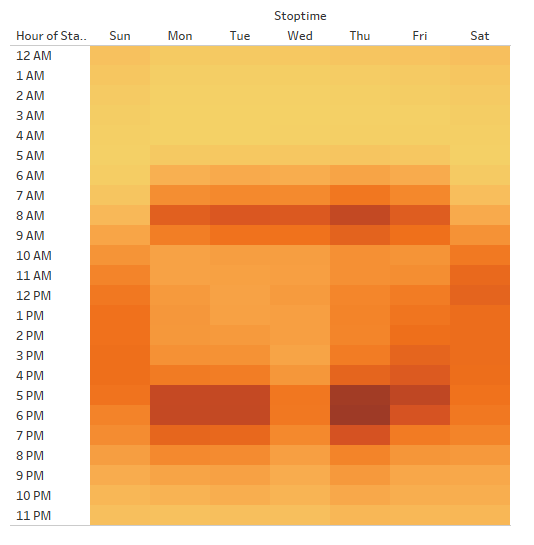
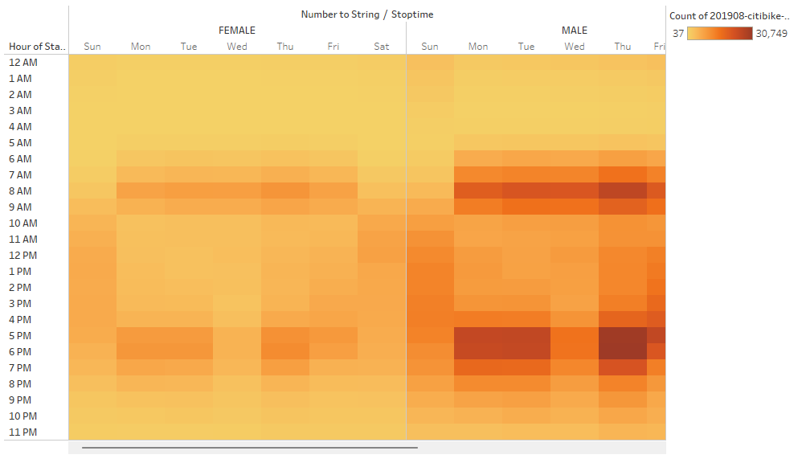
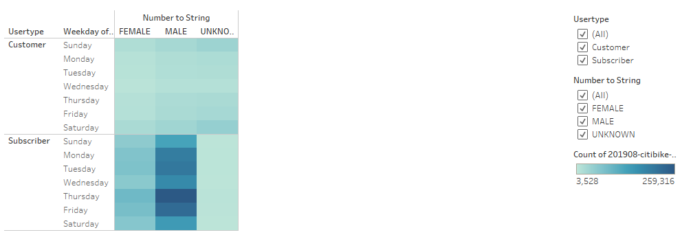
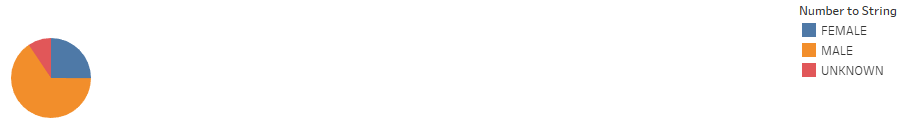
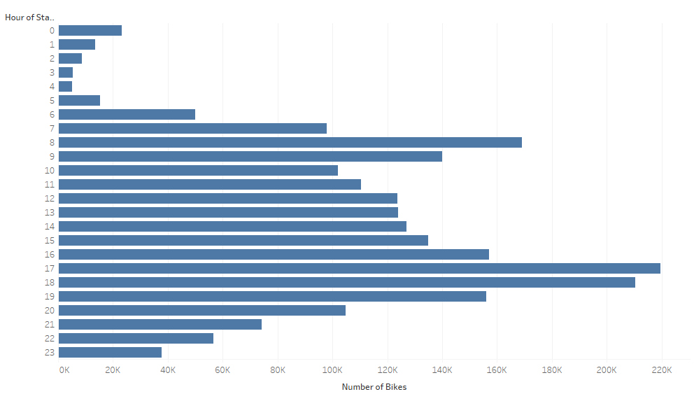

# bikesharing

[Find the Tableau Public link here](https://public.tableau.com/views/bikesharing_16670672453380/Story?:language=en-US&:display_count=n&:origin=viz_share_link)

## Overview of the analysis

The purpose of this analysis is to convince investors that a bike-sharing program in Des Moines is a solid business proposal. A presentation was made with visualizations that show:
* The length of time that bikes are checked out for all riders and genders
* The number of bike trips for all riders and genders for each hour of each day of the week
* The number of bike trips for each type of user and gender for each day of the week.

## Results

### Checkout Times for Users

Most trips last about 5 minutes.

### Checkout Times by Gender

There is a similar trip-duration distribution for each gender.

### Trips by Weekday per Hour

Weekdays peak around 8am and 5pm while weekends favor afternoons.

### Trips by Gender

There is a similar trip-time distribution for each gender.

### User Trips by Gender by Weekday

Subscribers favor weekdays more than customers.

### Gender Breakdown

About two thirds of riders are male.

### August Peak Hours

Ridership peaked around 8am and 5pm in August with a low at 4am.

## Summary

### High-level summary of the results

CitiBikes are a popular utility for work transportation with peaks in ridership directly before and after typical work hours. The service is also used throughout the day on weekends suggesting there may also be a strong cohort of liesure riders.

### Additional visualizations

1. Trip duration by user type
2. Trip duration by age